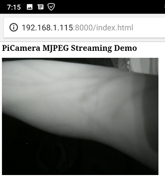

# Table Of Contents
1. [Feedback](#1-feedback)
2. [Progress Update](#2.-progress-update)
3. [Audit Log](#3.-audit-log)
4. [Concept of Operations](#4.-concept-of-operations)
5. [Meeting Minutes](#5.-meeting-minutes)
6. [Design Documents](#6.-design-documents)

# 1. Feedback
A feedback form has been created for the interest of our stakeholders, should they wish to pass on any changes or improvements they believe to be prudent. The form can be found [here](https://goo.gl/forms/8cw5eWdaOY5C1jBo1).

Once the feedback has been received, an issue will be created within the GitHub repository for public viewing and tracking.  
**Any feedback is welcome.**

# 2. Progress Update
## August 11th
The feedback received from the first project audit has been reviewed and a number of immediate actions have been identified:

**Version Control and Task Tracking** - This Github repository has an issue tracking ability. This is generally used by coders to track bugs and issues raised by users and the team, where both parties can communicate on the progress and resolutions. This function is being utilised in a way that tracks actionables: it reminds the team what is outstanding so there is always clear direction. Once a task is complete, the issue is closed and can be found under the **Closed** tab.

**Informal Language** - Several feedback responses came back with the informal language used in formal documents such as the meeting minutes. It is understood that this may look careless in regards to the direction of the project, and the use of this language will be minimised moving forward.

**Team Roles** -  To provide clarity on the team's dynamic, it was agreed from the onset that the team would work with each other to compete each and every aspect of the projects development. The "Roles" shown in our ConOps are indicators of who is responsible for sections of the project and who can be contacted with specific questions regarding those sections by external stakeholders.

For additional actionables, please view the current outstanding issues. New issues have been created to action major points raised by feedback during the first audit period. The documents requested in the feedback are in the process of being drafted.

We would like to thank everyone who provided feedback, each little bit will prove to be useful and valuable to the success of this project.

## Project Update
We will endeavour to keep this section updated once a week at the least, if necessary then more often (e.g. after a meeting) as requested from the feedback. Unfortunately not much progress was made during the week, as team members were predisposed with other tasks.

### Hardware/Software
Several attempts were made to get the HackADay software to run on the Raspberry Pi. Unfortunately, despite being configured appropriately, a connection to an external device could not be made. This meant that the first milestone could not be truly completed, as the HackADay concept could not be fully realised. The team put this down to changes in hardware and software versions in the last ~12 months, as well as the rushed nature of the Venenfinder code development. 

The decision was made to continue forward with the project and consider Milestone 1 complete. Enough information was learned during testing, and enough resources were collected to start developing more robust software for VeinCam. Already, a network stream has been established using new code. We can see in a sample image from this test code, we can visualise the veins in the arms of one of the team members:

Through the blurriness of a cropped image, and low output resolution, we can see what looks like the veins in their arms.

### Previous Progress Updates
* [August 1st](#progress-updates/progress-update-2018-08-01.md)
* [August 7th](#progress-updates/progress-update-2018-08-07.md)

# 3. Audit Log
Here we will have the information, results, and feedback to our audits, and will be presented in the following links (as they are created):

* Audit 1
* Audit 2
* Audit 3

Should our stakeholders wish to provide us with feedback, they can fill out a google survey in which we will action them appropriately as responses are presented to us.

# 4. Concept of Operations
Our Concept of Operations is nearly complete. after we have completed the feedback from Audit 1, we feel that this document will be ready for sign off.

The [Concept of Operations](docs/CONOPS.md) document can be found in our repository.

# 5. Meeting Minutes
Team meetings are scheduled twice a week, to ensure the team is aware of the overall progress made, as well to provide the client an opportunity to see what we have achieved, should they choose to join the meetings. They are currently scheduled for the following times:
* Wednesday 11pm
* Saturday 2pm

The Saturday Meeting is primarily made available for meeting with the client, and to provide a weekly update, where Wednesday is an internal midweek meeting to ensure our actionables are on track for completion. These times may vary, depending on the availability of the team, and client. 

Meeting Minutes can also be found in our repository:

## Last Meeting Minutes
* [August 11th](Meeting-Minutes/Meeting-Minutes-2018-08-11.md)

## Previous Meeting Minutes
* [July 31st](Meeting-Minutes/Meeting-Minutes-2018-07-31.md)  
* [August 1st](Meeting-Minutes/Meeting-Minutes-2018-08-01.md)
* [August 4th](Meeting-Minutes/Meeting-Minutes-2018-08-04.md)
* [August 8th](Meeting-Minutes/Meeting-Minutes-2018-08-08.md)

# 6. Design Documents
The design of the VeinCam will be presented here, once the ConOps has been approved, and progress/final designs are made available. the construction method of the device will also be presented here.
