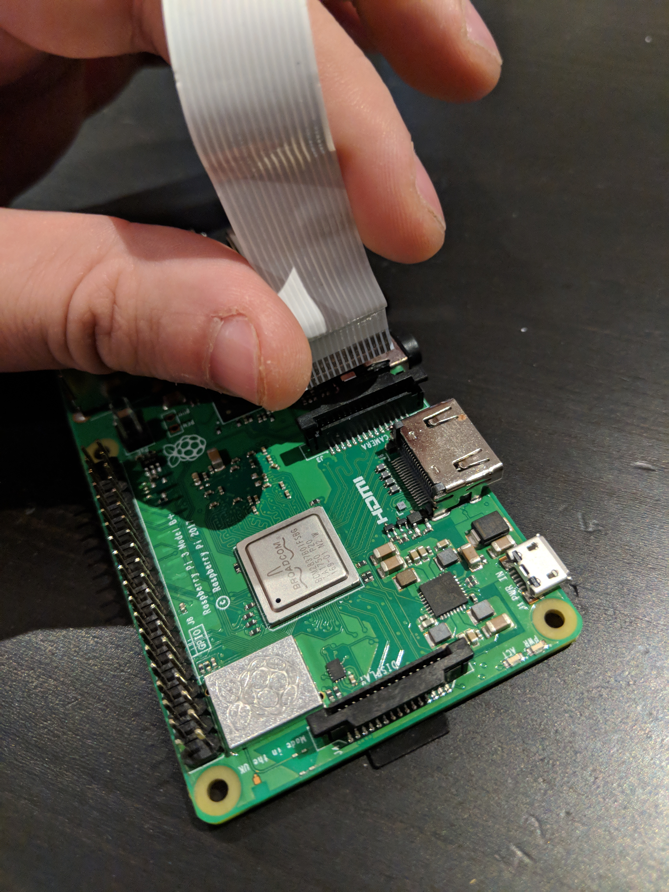
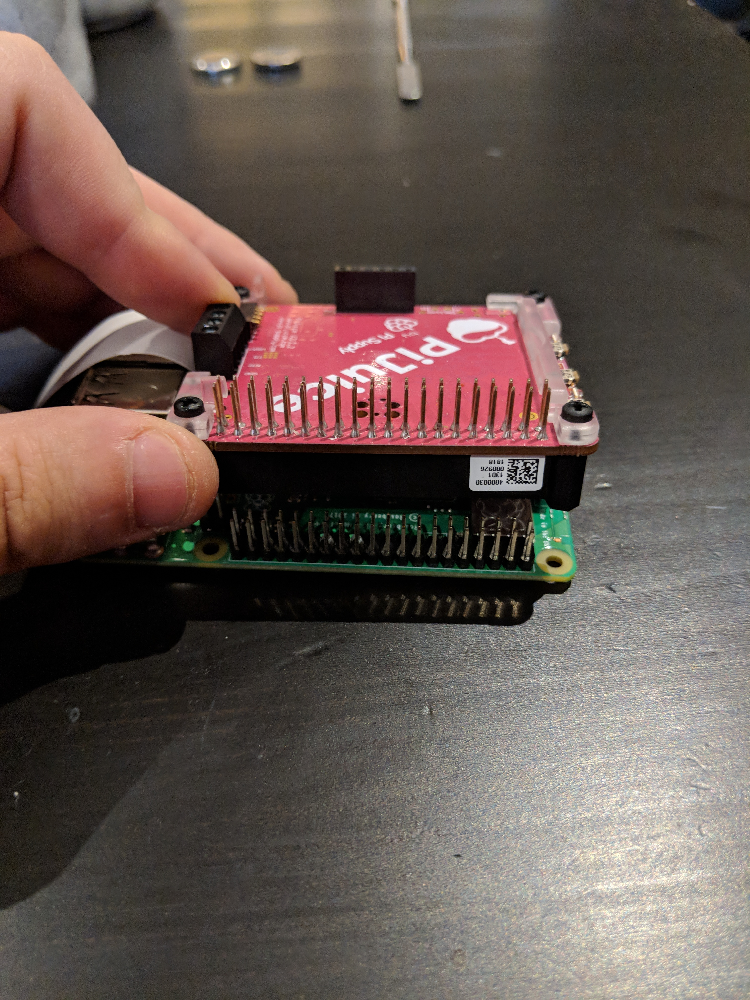

# Table of Contents
1. [Required Hardware](#required-hardware)
2. [Assembling the Raspberry Pi](#assembling-the-raspberry-pi)
3. [Assembling the LED Array (WARNING: BURN HAZARD)](#assembling-the-led-array-warning-burn-hazard)
4. [Preparing The Raspberry Pi for VeinCam (The Quick Way)](#preparing-the-raspberry-pi-for-veincam-the-quick-way)
5. [Preparing The Raspberry Pi for VeinCam (The Advanced Way)](#preparing-the-raspberry-pi-for-veincam-the-advanced-way)
    - [Preparing the SD Card](#preparing-the-sd-card)
    - [Configuring the PiJuice](#configuring-the-pijuice)
    - [Installing OpenCV](#installing-opencv)
        - [Preparing the Filesystem](#preparing-the-filesystem)
        - [Installing the OpenCV Dependencies](#installing-the-opencv-dependencies)
    - [Installing OpenCV](#installing-opencv)
    - [Preparing the Python Compiler](#preparing-the-python-compiler)
    - [Compiling and Installing](#compiling-and-installing)
    - [Wireless Hotspot Configuration](#wireless-hotspot-configuration)
6. [Preparing for VeinCam Autostart](#preparing-for-veincam-autostart)
7. [Running the VeinCam Software](#running-the-veincam-software)
8. [Encasing the VeinCam](#encasing-the-veincam)

# Required Hardware
- [Raspberry Pi 3 (Model B+)](https://www.raspberrypi.org/products/raspberry-pi-3-model-b-plus/)
- [Raspberry PiCam NoIR](https://www.raspberrypi.org/products/pi-noir-camera-v2/)
- PiJuice HAT for the Raspberry Pi
- ~750nm Infrared Filter
- 6 850nm Infrared LEDs
- 65mm x 95mm Veraboard (may need to cut a slightly larger one down)
- 16GB MicroSD Card
- 8 3mmx5mm diameter disk magnets
- 3 20mmx10mmx3mm cuboid magnets
- Micro USB phone charger (2.1A output required)

# Assembling the Raspberry Pi
Attach the NoIR Camera module to the Raspberry Pi (RPi). To do this, disengage the lock on the port by lifting the edge tabs until you feel a click. The ribbon cable should be orientated as seen in the image below:

<div class="row">
  <div class="column">
    
  </div>
  <div class="column">
    
  </div>
</div>

Once the cable is firmly seated, press down on the edge tabs once again until you feel that click. Place the camera module down like in the next image, where the ribbon cable sits over the rear ports of the RPi. Put a slight kink in the ribbon cable support (Blue plastic) to help keep the cable flat.

<div class="row">
  <div class="column">
    
  </div>
  <div class="column">
    
  </div>
</div>

Install the PiJuice HAT onto the RPi. ensure that the pins on the RPi are aligned to the header on the underside of the PiJuice. The screw posts on the PiJuice should all align with the holes on the RPi board. Make sure you move the camera ribbon cable out of the way of the screw posts near the ports. Damage to the cable can result in the camera being unusable.

<div class="row">
  <div class="column">
    
  </div>
  <div class="column">
    
  </div>
</div>

# Assembling the LED Array (WARNING: BURN HAZARD)
WARNING: There is great potential to burn yourself if you are not skilled in electronic soldering. Seek assistance as required!

Study the image below carefully. the prototyping board should have grid references for you to use. each LED must have a 220-ohm resistor attached to the positive (longer) leg, which is attached to a 5v voltage rail, while the negative LED is connected to a ground rail.

<div class="row">
  <div class="column">
    
  </div>
  <div class="column">
    
  </div>
</div>

Connect the Positive wire to the 5V header on the PiJuice, and the negative wire to the Ground Pin.

<div style="text-align:center"></div>

# Preparing The Raspberry Pi for VeinCam (The Quick Way)
Download a program called [Etcher](https://etcher.io/) which is available on all desktop platforms. Etcher is a simple tool to flash ISO files to USBs and SD Cards. Also download the ISO file found [here](https://drive.google.com/file/d/1dWCqL9uJaJdlJALsTNYojDlLWLJRyn4l/view?usp=sharing) and save it to you computer.

Run Etcher once it is installed, and insert the microSD card into your computer - most microSD cards come with an SD Card adapter to make this easier, and Etcher will auto-detect the card within a few seconds. Click the 'Select Image' button and navigate to where you downloaded and saved the ISO file.

The 'Flash!' button should now be available. Click it and wait for the flashing process to complete. Do not touch the SD card while this completes as you can corrupt the card and have to start again. Make sure your computer does not go to sleep or turn off during this process as well.

When the flash is complete, Etcher will prompt you with 'Flash Complete'. Remove the card from your computer and put it into the microSD slot on the underside of the RPi. Connect the power cable to the PiJuice and press the button closest to the charger. See [The User Guide](/User-Manual.md) on how to connect to the device with your personal device.

# Preparing The Raspberry Pi for VeinCam (The Advanced Way)
Install the Raspbian operating system. At time of writing, Stretch is the latest version, and can be downloaded from the Raspberry Pi Website. You can install either the full desktop version, or the lite version for those who are familiar with navigating through a Command Line Interface. You will need a Desktop/Laptop for the remainder of the guide (Windows, Mac or Linux), one with an microSD/SD Card slot, otherwise you will also require a USB adapter.

## Preparing the SD Card
This guide uses the Full Desktop version. Download the Raspbian ISO file [Here](https://www.raspberrypi.org/downloads/) and save it to your computer. Download a program called [Etcher](https://etcher.io/) which is available on all desktop platforms. Etcher is a simple tool to flash ISO files to USBs and SD Cards.

Run Etcher once it is installed, and insert the microSD card into your computer - most microSD cards come with an SD Card adapter to make this easier, and Etcher will auto-detect the card within a few seconds. Click the 'Select Image' button and navigate to where you downloaded and saved the ISO file.

The 'Flash!' button should now be available. Click it and wait for the flashing process to complete. Do not touch the SD card while this completes as you can corrupt the card and have to start again. Make sure your computer does not go to sleep or turn off during this process as well.

When the flash is complete, Etcher will prompt you with 'Flash Complete'. Remove the card from your computer and put it into the microSD slot on the underside of the RPi. Connect the necessary cables to the RPi - you will need a keyboard, mouse, ethernet cable (connected to your router) and a monitor connected via HDMI.

Once this is done, connect power to the Micro USB port on the PiJuice (this will start charging the battery) and press the small button closest to the USB port. A red LED on the RPi board will illuminate, indicating it has turned on. You will see it booting up on your screen, and within 15 seconds it will display the RPi desktop with the 'Welcome to Raspberry Pi' dialog box. this is a first run program to configure your RPi. Step through and fill in the required information. DO NOT configure a Wi-Fi network to the device, as it will be overridden by the Wi-Fi hotspot software and can cause issues.

## Configuring the PiJuice
Open up a terminal window, and run the following command
```
sudo apt-get install pijuice-gui
```
This will install the software required to configure the PiJuice.

**set up for switches**

## Installing OpenCV
### Preparing the Filesystem
This install guide follows what is detailed [on this page](https://www.pyimagesearch.com/2017/09/04/raspbian-stretch-install-opencv-3-python-on-your-raspberry-pi/). Images in this guide are courtesy of the original guide.
First expand the file system to fill the entire SD Card. In the terminal:
Type
```
sudo raspi-config
```

Navigate to **7. Advanced Options > A1 Expand Filesystem** and step through any prompts. Reboot the Pi if prompted to do so after expanding the filesystem, otherwise type the following into the terminal.
```
sudo reboot
```

Once rebooted, the file system should fill the SD card. You can use ```df -h``` to check this. ```/dev/root``` should be a similar size to the SD Card.

Some space can be freed from the default install by removing some software. Wolfram and Libreoffice will not be used on the platform, and takes up around a 1GB of storage. Use the code below to remove these applications from the system:
```
sudo apt-get purge wolfram-engine
sudo apt-get purge libreoffice*
sudo apt-get clean
sudo apt-get autoremove
```
the purge commands will remove the core applications, while the clean and autoremove clear out any links to the applications, and remove any unused dependencies for more free space. this may take several minutes to complete.


### Installing the OpenCV Dependencies
Especially if you are starting from a fresh install of Raspbian, it is crucial to update the system, to ensure the repository and core system functions are up to date.
```
sudo apt-get update && sudo apt-get upgrade
```
This command will update the repository first, then update the system using the now updated repository. again, this may take several minutes to complete - depending on your Pi and internet connection.

Next is to install the compiling packages
```
sudo apt-get install build-essential cmake pkg-config
```

the next commands install various packages to help compile OpenCV.
```
sudo apt-get install libjpeg-dev libtiff5-dev libjasper-dev libpng12-dev
sudo apt-get install libavcodec-dev libavformat-dev libswscale-dev libv4l-dev
sudo apt-get install libxvidcore-dev libx264-dev
sudo apt-get install libgtk2.0-dev libgtk-3-dev
sudo apt-get install libatlas-base-dev gfortran
sudo apt-get install python2.7-dev python3-dev
```
Note that each line has to be run individually, as some packages have dependencies located in the command above it.

## Downloading OpenCV
There are 2 packages that are required for download, in order of OpenCV to run. you can grab them bun running the commands below:
```
cd ~
wget -O opencv.zip https://github.com/Itseez/opencv/archive/3.4.2.zip
wget -O opencv_contrib.zip https://github.com/Itseez/opencv_contrib/archive/3.4.2.zip
unzip opencv.zip
unzip opencv_contrib.zip
```
At the time of writing, version 3.4.2 is the latest version. If there is a later version, simply change the version numbers. Note that the version numbers must match for these packages to compile.

## Preparing the Python Compiler
Before we get started, we need a Python Package Manager
```
wget https://bootstrap.pypa.io/get-pip.py
sudo python get-pip.py
sudo python3 get-pip.py
```
The package manager is used to help maintain Python-specific packages, in the same way that the Raspbian Repository maintains software packages for the OS. One particular package we need is the Virtual Environment package and dependencies. The Virtual Environment enables the ability to create sandboxed environments where Python can execute without interference from other python packages. (like having individual users on one system, where documents and such do not collide with one another).

We can install these packages like so:
```
sudo pip install virtualenv virtualenvwrapper
sudo rm -rf ~/.cache/pip
```
We will also need to update the terminal profile to load these packages for quick reference. Use a terminal editor such as nano to edit the following file:
```
sudo nano ~/.profile
```
and add the following lines to the bottom of the file:
```
# virtualenv and virtualenvwrapper
export WORKON_HOME=$HOME/.virtualenvs
export VIRTUALENVWRAPPER_PYTHON=/usr/bin/python3
source /usr/local/bin/virtualenvwrapper.sh
```
Reload the terminal profile simply by running the command:
```
source ~/.profile
```
You will see the terminal load in the Python packages we installed previously.
Now we create the virtual environment. Depending what version of python you wish to run with, execute one of the following commands:
```
# Python 2.7
mkvirtualenv cv -p python2

# Python 3.5
mkvirtualenv cv -p python3
```

Upon creation of the environment, it's name (in this case is cv) will appear in parentheses as a prefix to the command entry in the terminal, which can be seen below.


If this is not the case, use the commands below to enter the virtual environment
```
source ~/.profile
workon cv
```

**workon cv** is the command that enters the environment. Prior to this, we reload the profile to ensure the virtual environment packages are loaded into the terminal.

Next we need to install NumPy, a package used for numerical processing, which will in part will allow for numerical image processing for our automated controls. (BETTER EXPAND THIS)
```
pip install numpy
```

## Compiling and Installing
Now its time for the installation. But first we need to compile the software. **Note that it will take more than an hour to successfully compile**. Before we start, make sure you are in the virtual environment
```
workon cv
```
Run the following commands to create the build file for OpenCV. Note that if you are using a different version of OpenCV than what is used in this guide, be sure to change the version numbers otherwise it will not compile.
```
cd ~/opencv-3.4.2/
mkdir build
cd build
cmake -D CMAKE_BUILD_TYPE=RELEASE \
    -D CMAKE_INSTALL_PREFIX=/usr/local \
    -D INSTALL_PYTHON_EXAMPLES=ON \
    -D OPENCV_EXTRA_MODULES_PATH=~/opencv_contrib-3.4.2/modules \
    -D BUILD_EXAMPLES=ON ..
```
Examine the output to ensure that Interpreter, Libraries, NumPy and packages path fields of the output are pointing to the correct directories. It should look similar to the images below, depending on the Python version you are using. In this case, we are using Python 3. We can also see the Python 2 links above the red box.


Now we need to change the file swap size. the default used by Raspbian is small, and could cause compilation errors. run the command below to open up the swap file configuration file in nano:
```
sudo nano /etc/dphys-swapfile
```

Look for the CONF_SWAPSIZE parameter from 100 to 1024. this will increase the swap file to 1GB. Note that we will need to change it back after compilation, as it could fill up the SD card over time, very quickly. the parameter should now look like this:
```
CONF_SWAPSIZE=1024
```
Once this is done, we need to ensure that the change takes effect. Run the commands below to restart the swapfile service.
```
sudo /etc/init.d/dphys-swapfile stop
sudo /etc/init.d/dphys-swapfile start
```
Now we can start the compilation. Again, be aware that the compilation process will take more than an hour to complete. you also should still be in the build directory.
```
cd ~/opencv-3.4.2/build
make -j4
```
When the compilation is complete, we can start the install onto the Pi.
```
sudo make install
sudo ldconfig
```

Lastly, execute one of the following blocks of code, depending on the version of Python you compiled with. These blocks create the symbolic link between the OpenCV packages and the virtual environment we created earlier.

```
# Python 2.7
cd ~/.virtualenvs/cv/lib/python2.7/site-packages/
ln -s /usr/local/lib/python2.7/site-packages/cv2.so cv2.so
```

```
# Python 3.5
cd /usr/local/lib/python3.5/site-packages/
sudo mv cv2.cpython-35m-arm-linux-gnueabihf.so cv2.so

cd ~/.virtualenvs/cv/lib/python3.5/site-packages/
ln -s /usr/local/lib/python3.5/site-packages/cv2.so cv2.so
```
## Wireless Hotspot Configuration
This is mainly takes one command to fully configure using the [RaspAP Utility](https://github.com/billz/raspap-webgui). This utility installs the required dependencies and configures the Raspberry Pi into a self-serving Internet access point. The advantage to this is that it can allow connections from multiple devices and allow them 'Internet' access, like a modem would. Internet can also be passed through the RasPi via its on board ethernet port.

Before setup, disconnect any wireless networks the device may already be connected to, and plug in an ethernet cable. Execute the command below and it will download the required files and start the install.

```
wget -q https://git.io/voEUQ -O /tmp/raspap && bash /tmp/raspap
```

It will prompt you for input, accept them by typing 'y' and hitting enter (as some prompts are defaulted to 'no' when you hit enter). The Pi will need a reboot when prompted to do so. Once it has rebooted, you should see a new WiFi called ``raspi-webgui``. This is the newly configured access point. The default parameters are as below:
* SSID: raspi-webgui
* Password: ChangeMe
* IP address: 10.3.141.1
  - Login Username: admin
  - Login Password: secret
  - DHCP range: 10.3.141.50 to 10.3.141.255

You can log into the web interface, and change parameters by using the login details listed above. These are the default parameters, so you may wish to change them. Below are the parameters we used.
* SSID: VeinCam
* Password: ANUVeinCam
* Channel: 6

## Preparing for VeinCam AutoStart
During our development, we encountered an error where the bash profile would not autorun on user log in. We determined that this was likely due to the OS was preconfigured to log into the desktop environment automatically, and the profile script does not automatically load.

To fix this, we need to switch to the CLI environment for boot, and back again. to do this, open a terminal and execute the command
```
sudo raspi-config
```
and navigate to **"3 Boot options > B1 Desktop / CLI > Console Autologin"** and go finish. it will ask you to reboot. Accept and you will be booted into the command line interface. Run the config command again and go to **"3 Boot options > B1 Desktop / CLI > Desktop Autologin"** this time, and reboot. This should allow the profile to autoload on user login.

## Running the VeinCam Software
Ensure you are in the OpenCV environment:
```
source ~/,profile
workon cv
```
and run the next 2 commands:
```
pip3 install flask
pip3 install picamera
```
These are the last of the software required to run the VeinCam software - Flask is a python framework that extends what python can do, and is useful in our case to convert HTML into python commands (loading the web stream and controlling its parameters). The picamera module is for the camera itself, as the full library is not present within the python environment.


Download our [final code archive](Software/Final.zip) and save them to the home directory (/home/pi).

In a terminal, run the below command
```
sudo nano ~/.profile
```
and add these two lines to the bottom of the file
```
workon cv
bash launcher.sh
```
Reboot your device, and you should be able to connect to it with your personal device using the settings you configured during [the Hotspot configuration](#wireless-hotspot-configuration).

## Encasing The VeinCam
With everything else complete, the only thing left is to put it into a case. [Our custom case](/CAD-Drawings/v2.3) is designed to house all the components comfortably. You can download the design and 3D print it yourself, have someone help you, or get in contact with a 3D printing service.

Or you can create your own! Internal compartment dimensions are as follows:

* 100mm long
* 65mm deep
* 40mm high

we used small neodymium disk magnets to secure the lid to the main compartment, and provides a nice snap shut fit. Check out the final drawings in our repository!
