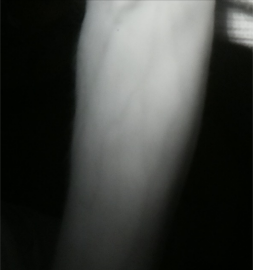

# What We're Doing
The main goal of our project is to ease patient discomfort. To do this we're using the VeinCam to make it easier for medical professionals to see veins in patients for superficial venous puncture.

# How We're Doing It
Not only are we making it easier, we're giving the power to them; developing an open-source DIY VeinCam and how-to guide so that anyone who needs one can build it themselves. We're providing a guide of what to buy, how to put it together and the software to upload to get it all working.

# Where We're At
Right now we're still working on getting it up and running but we have managed to get a few images from our setup:

