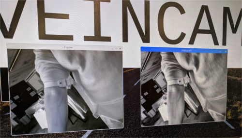
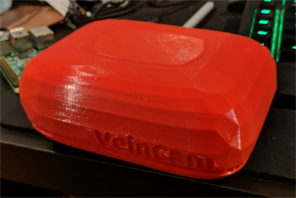
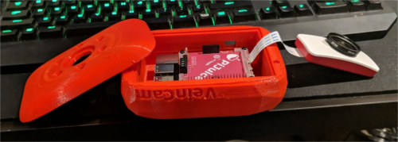

## What We're Doing
The main goal of our project is to ease patient discomfort. To do this we're developing the VeinCam to make it easier for medical professionals to visualise superficial veins in patients for venous puncture.

## How We're Doing It
The VeinCam uses near infrared (nIR) light and a camera to stream a real-time image where candidate veins can be easily seen. It is going to be an open-source, build-it-yourself device so anyone who needs one will be able to construct it. We'll provide a how-to guide of what materials to buy, how to put them together and the software to upload to get it all working.

## When We're Done
This page will provide all the necessary downloads, links and resources that you'll need to construct a VeinCam yourself.

## Where We're At Now
We were able to show off our latest prototype at the ANU open day and doing some simple tests we were able to demonstrate our automatic contrast adjustment. We are still working on optimising this and getting a stream going to allow for wireless use.

We've also begun protoyping a chassis, but at the moment it is a bit big and we're still working on mounting all the bits and pieces.

### For more details check out our [GitHub site](https://github.com/chrisbodger/VeinCam)
