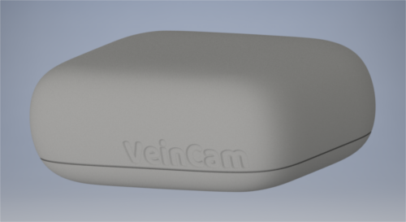
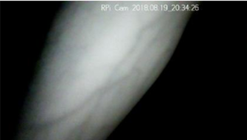

# What We're Doing
The main goal of our project is to ease patient discomfort. To do this we're using the VeinCam to make it easier for medical professionals to see veins in patients for superficial venous puncture.

# How We're Doing It
Not only are we making it easier, we're giving the power to them by developing an open-source DIY VeinCam and how-to guide so that anyone who needs one can build it themselves. We're providing a guide of what to buy, how to put it together and the software to upload to get it all working.

# When We're Done
This page will provide all the necessary downloads, links and resources that you'll need to construct a VeinCam yourself.

# Where We're At Now
Right now we're still working on getting it up and running but we have an image from our setup (as you can see we're using [Raspberry Pi](https://www.raspberrypi.org/) materials as they're available all over the world):

Our latest tests have been giving us some pretty good results as you can see below, but we're still working on adding automatic and manual contrast adjustment as well as a few other features.

## For more details check out our [GitHub site](https://github.com/chrisbodger/VeinCam)
