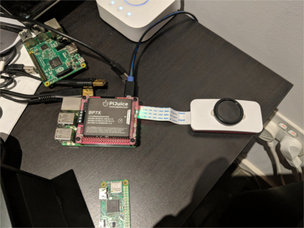

## What We're Doing
The main goal of our project is to ease patient discomfort. To do this we're developing the VeinCam to make it easier for medical professionals to visualise superficial veins in patients for venous puncture.

## How We're Doing It
The VeinCam uses near infrared (nIR) light and a camera to stream a real-time image where candidate veins can be easily seen. It is going to be an open-source, build-it-yourself device so anyone who needs one will be able to construct it. We'll provide a how-to guide of what materials to buy, how to put them together and the software to upload to get it all working.

## When We're Done
This page will provide all the necessary downloads, links and resources that you'll need to construct a VeinCam yourself.

## Where We're At Now
Right now we're still working on getting it up and running but we have an image from our setup (as you can see we're using [Raspberry Pi](https://www.raspberrypi.org/) materials as they're available all over the world):

Our latest tests have been giving us some pretty good results as you can see below, but we're still working on adding automatic and manual contrast adjustment as well as a few other features.

### For more details check out our [GitHub site](https://github.com/chrisbodger/VeinCam)
