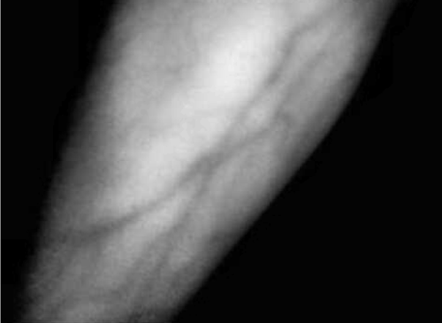
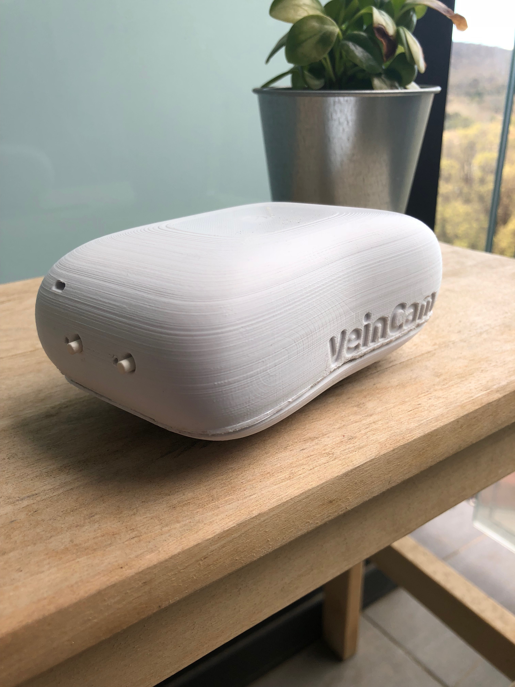

## What is the VeinCam
The VeinCam is an educational tool for vein visualisation that uses. It uses near infrared (nIR) light and a camera to stream a real-time image where veins can be easily seen. It is an open-source, build-it-yourself device so anyone who finds it useful will be able to construct it. There is a how-to guide of what materials to buy, how to put them together and the software to upload to get it all working.

## Current Stage
The VeinCam has been through a couple of prototypes to get to its current stage; which includes a functioning case, automatic image processing and manual controls on a streamed webpage. The current prototype looks absolutely stunning along side our favourite houseplant, Hugh!

  

    

      
    

    

      
    

  

  

    

      
    

    

      
    

  

### To contribute or find out more check out the [GitHub site](https://github.com/chrisbodger/VeinCam) or email at <message2ben@gmail.com>
